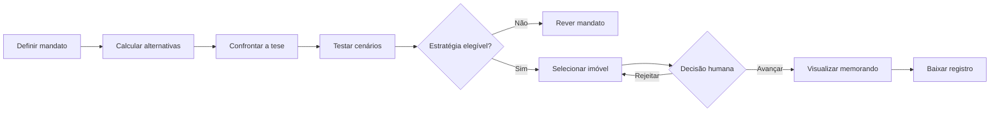

# Quebre a Tese

Link: https://jovens-talentos-2026-hackathon-data-gxcz26qwamcznwqmayecfy.streamlit.app/

Sistema de apoio à decisão de investimento imobiliário para a Seazone. O
produto transforma os dados de Airbnb e VivaReal de Itapema em uma decisão
condicionada: qual perfil priorizar, quais imóveis investigar e o que precisaria
acontecer para a recomendação mudar.

Não é um dashboard para exploração passiva. É um workflow em que o decisor:

1. define o mandato;
2. recebe uma recomendação calculada;
3. tenta derrubá-la com cenários adversos;
4. verifica as evidências originais;
5. escolhe ou rejeita um imóvel;
6. registra a decisão em um memorando reproduzível.

## Resposta Executiva

> **A tese de compactos no Centro não é sustentada pelo critério de eficiência
> do capital adotado. A prioridade é diligenciar apartamentos de 2 quartos em
> Morretes, sem autorizar uma compra antes de validar ocupação, custos e
> restrições operacionais.**

No cenário-base, com orçamento máximo de R$ 1 milhão e ocupação anual
ilustrativa de 62,5%:

| Evidência | Centro Studio/1Q | Morretes 2Q |
|---|---:|---:|
| Tarifa típica anunciada | R$ 445 | R$ 464 |
| Preço pedido típico | R$ 890 mil | R$ 790 mil |
| Receita bruta anualizada de cenário | R$ 101.516 | R$ 105.850 |
| Retorno bruto de cenário | 11,4% | 13,4% |
| Anúncios de short stay precificados | 78 | 51 |
| Ofertas de venda válidas | 19 | 892 |
| Cobertura de preços no Airbnb | 66,1% | 22,3% |

Morretes 2Q combina tarifa ligeiramente maior com preço pedido típico R$ 100
mil menor. A vantagem estimada é de aproximadamente 2,0 pontos percentuais de
retorno bruto.

A força da evidência é classificada como **limitada**. O resultado autoriza uma
fila de diligência, não uma ordem de compra.

Leia a defesa completa em [`relatorio.md`](relatorio.md).

## O Produto

### 1. Mandato Antes Do Resultado

O usuário começa definindo:

- capital máximo por imóvel;
- ocupação do cenário inicial;
- política de evidência padrão ou conservadora.

Isso impede que o sistema procure uma justificativa depois de conhecer o
resultado. Segmentos acima do orçamento ou abaixo da amostra mínima ficam fora
do mandato.

### 2. Confronto De Estratégias

A hipótese fornecida pela Seazone, **Centro Studio/1Q**, é comparada ao segmento
elegível com maior retorno bruto de cenário. A aplicação mostra lado a lado:

- tarifa anunciada;
- ocupação assumida;
- preço de aquisição;
- receita anualizada de cenário;
- retorno bruto de cenário.

O desafiante é selecionado pelo motor, não escrito previamente na interface.

### 3. Laboratório De Cenários

O decisor pode alterar separadamente para cada estratégia:

- ocupação;
- choque positivo ou negativo na tarifa;
- preço de aquisição.

O vencedor, o preço-limite e a shortlist são recalculados imediatamente. O botão
**Aplicar menor choque ao vencedor** leva automaticamente a comparação ao ponto
de empate.

Uma mudança nas premissas invalida qualquer aprovação anterior. Isso impede que
um memorando seja associado a um cenário diferente daquele efetivamente
aprovado.

### 4. Evidências E Dados Originais

A trilha separa três categorias:

| Categoria | Exemplo |
|---|---|
| Observado | tarifa anunciada e preço pedido |
| Calculado | mediana, receita anualizada e retorno bruto |
| Assumido | ocupação e preço testado pelo usuário |

As cinco bases originais podem ser consultadas dentro da aplicação com nomes de
colunas em português. A interface mostra uma prévia de 100 registros e permite
baixar o CSV integral.

### 5. Gates De Aprovação

O sistema mantém visíveis as condições que os dados não resolvem:

- ocupação e tarifa efetivamente realizadas;
- disponibilidade e preço negociável;
- permissão condominial para short stay;
- estágio da obra, mobiliário e custos recorrentes.

Enquanto esses gates estiverem abertos, o status permanece **diligenciar, não
comprar**.

### 6. Decisão Registrada

O usuário pode selecionar ou rejeitar imóveis da fila. Ao avançar um candidato,
a aplicação apresenta primeiro uma visualização da decisão com preço, retorno e
limite de compra. Em seguida, disponibiliza o memorando completo para leitura e
download em Markdown.

## Jornada



## Contrato Da Decisão

O cenário-base procura o maior retorno bruto entre segmentos que atendam a
todos estes critérios:

- imóvel classificado como apartamento nas duas fontes;
- bairro e perfil de quartos presentes no Airbnb e no VivaReal;
- pelo menos 20 anúncios de short stay com tarifa na política padrão;
- pelo menos 15 ofertas de venda válidas na política padrão;
- preço pedido típico dentro do orçamento declarado.

A política conservadora aumenta os cortes para 40 anúncios de short stay e 30
ofertas de venda.

### Fórmulas

```text
Tarifa típica do anúncio
    = mediana das tarifas após deduplicar cada data de estadia

Tarifa típica do segmento
    = mediana das tarifas típicas dos anúncios

Receita bruta anualizada de cenário
    = tarifa no cenário × 365 × ocupação assumida

Retorno bruto de cenário
    = receita bruta anualizada / preço de aquisição testado
```

O horizonte anual serve para comparação. Como os preços disponíveis cobrem
apenas janeiro a abril, ele não representa uma previsão anual validada.

## Ponto De Reversão

No cenário-base, Morretes 2Q deixa de liderar se uma destas mudanças ocorrer
isoladamente:

- sua tarifa típica cair aproximadamente 14,9%;
- sua ocupação ficar cerca de 9,3 pontos percentuais abaixo da ocupação dos
  compactos no Centro;
- seu preço pedido típico superar aproximadamente R$ 928 mil;
- compactos no Centro puderem ser adquiridos por aproximadamente R$ 758 mil.

Esses são pontos de empate, não garantias de retorno. O laboratório permite
testar combinações diferentes dessas condições.

## Buy Box Inicial

| Critério | Diretriz inicial |
|---|---|
| Bairro | Morretes |
| Tipo | Apartamento |
| Quartos | 2 |
| Área central do segmento | 65 a 70 m² |
| Capital máximo do mandato | R$ 1 milhão |
| Preço comparativo de reversão | R$ 928 mil |
| Estado | Diligência |

O primeiro anúncio da fila é o VivaReal `2646969738`, com 70 m², dois quartos,
uma vaga e preço pedido de R$ 450 mil. O valor está muito abaixo da faixa típica,
portanto deve ser tratado como sinal de verificação, não como oportunidade já
confirmada.

## Tratamento Dos Dados

- IDs são preservados como texto, inclusive identificadores de 19 dígitos.
- `Details` e `Mesh` são unidos 1:1 por `airbnb_listing_id`.
- Recapturas do mesmo anúncio e data de estadia são reduzidas à captura mais
  recente no cenário-base.
- Cada imóvel recebe primeiro sua tarifa mediana; somente depois é calculada a
  mediana do segmento.
- Airbnb e VivaReal são restringidos a apartamentos para manter comparabilidade.
- Ofertas do VivaReal são deduplicadas por ID e por assinatura de conteúdo.
- Republicações com diferença de até R$ 1 mil na mesma assinatura são agrupadas.
- Limites amplos de área, preço e preço por m² removem erros evidentes de unidade.
- Conflitos entre bairro informado e URL são excluídos da shortlist e usados em
  um teste alternativo de robustez.
- Custos ausentes ou implausíveis viram pendência de diligência, nunca vantagem
  econômica.

## Robustez

O duelo é recalculado sob quatro tratamentos:

1. Captura mais recente de cada diária.
2. Primeira captura de cada diária.
3. VivaReal sem deduplicação adicional de conteúdo.
4. Somente bairros consistentes com a URL do anúncio.

Morretes 2Q lidera nos três tratamentos em que os dois lados passam pelo corte
amostral. No quarto, a tese do Centro não possui amostra de venda suficiente e o
resultado é classificado como inconclusivo.

Resultados: [`outputs/robustez.csv`](outputs/robustez.csv).

## Limitações

Os dados permitem observar oferta e preços anunciados, não desempenho realizado:

- 999 dos 4.441 anúncios Airbnb têm preços vinculáveis, cobertura de 22,5%;
- as tarifas abrangem 105 dias, entre 06/01/2025 e 20/04/2025;
- ausência de uma diária não prova que ela tenha sido reservada;
- não há ocupação, receita realizada ou duração das estadias;
- o VivaReal contém preços pedidos, não preços transacionados;
- não existe ligação imóvel a imóvel entre Airbnb e VivaReal;
- condomínio, IPTU, estágio da obra e restrições operacionais são incompletos.

Por isso, o projeto não chama o indicador de NOI, cap rate líquido ou retorno
realizado.

## Uso De IA

A IA foi utilizada para:

- explorar hipóteses;
- questionar definições de “melhor”;
- identificar riscos metodológicos;
- revisar implementações e encontrar inconsistências;
- estruturar a comunicação da decisão.

A IA não calcula tarifas, receitas, retornos, rankings, pontos de reversão ou a
shortlist. Essas operações são determinísticas e testadas em Python. Também não
há agentes conversando entre si apenas para simular complexidade.

O histórico integral das sessões deve ser armazenado em [`ai-log/`](ai-log/).

## Arquitetura

```text
Dados CSV
   │
   ▼
src/engine.py
   ├── validação e normalização
   ├── deduplicação
   ├── segmentos comparáveis
   ├── contrato da decisão
   ├── cenários assimétricos
   ├── ponto de reversão
   └── shortlist
   │
   ├── outputs/              artefatos reproduzíveis
   └── app.py                workflow de decisão
                                  │
                                  └── memorando de diligência
```

| Caminho | Responsabilidade |
|---|---|
| `app.py` | Mandato, laboratório, evidências e decisão humana |
| `src/engine.py` | Fonte numérica da verdade |
| `scripts/export_evidence.py` | Regeneração dos artefatos |
| `outputs/decisao.json` | Tese, desafiante, premissas e reversão |
| `outputs/segmentos.csv` | Métricas de todos os segmentos |
| `outputs/robustez.csv` | Testes metodológicos alternativos |
| `outputs/shortlist.csv` | Fila inicial de diligência |
| `relatorio.md` | Recomendação final detalhada |
| `tests/test_engine.py` | Testes das regras e fórmulas |
| `ai-log/` | Conversas integrais com IA |

## Como Executar

Requisitos: Python 3.10 ou superior e `pip`.

```bash
git clone https://github.com/mateuxcv/jt2026-mateus-victor.git
cd jt2026-mateus-victor
python3 -m venv .venv
source .venv/bin/activate
pip install -r requirements.txt
streamlit run app.py
```

A aplicação abrirá em `http://localhost:8501`.

## Como Usar

1. Informe o capital máximo e a ocupação inicial.
2. Escolha a política de evidência e execute a análise.
3. Compare a tese interna com o desafiante selecionado.
4. Use o botão de choque automático ou altere as premissas manualmente.
5. Consulte as evidências e os dados originais quando necessário.
6. Selecione um imóvel e abra o anúncio original.
7. Rejeite o candidato ou avance-o para diligência.
8. Revise a visualização do memorando antes de baixá-lo.

## Reproduzir Os Artefatos

```bash
python scripts/export_evidence.py
```

Arquivos gerados:

- [`outputs/decisao.json`](outputs/decisao.json)
- [`outputs/segmentos.csv`](outputs/segmentos.csv)
- [`outputs/robustez.csv`](outputs/robustez.csv)
- [`outputs/shortlist.csv`](outputs/shortlist.csv)

## Testes

```bash
python -m unittest discover -v
```

A suíte cobre normalização, deduplicação, orçamento, mudança de vencedor,
condições de reversão e shortlist.

## Estrutura

```text
.
├── ai-log/                  histórico integral de IA
├── data/                    cinco bases originais
├── outputs/                 resultados reproduzíveis
├── scripts/                 exportação das evidências
├── src/                     motor determinístico
├── tests/                   testes automatizados
├── app.py                   aplicação Streamlit
├── relatorio.md             parecer de investimento
└── requirements.txt
```

## Checklist De Entrega

- [x] Recomendação escrita e posição sobre a tese do Centro.
- [x] Código e artefatos reproduzíveis.
- [x] Aplicação executável e testes automatizados.
- [x] Dados originais acessíveis pela interface.
- [ ] Exportar esta sessão completa para `ai-log/`.
- [ ] Adicionar o link público do vídeo na primeira linha.
- [ ] Validar repositório e vídeo em uma janela anônima.

## Desafio

[Hackathon Jovens Talentos AI Builder 2026](https://seazone-tech.github.io/jovens-talentos-2026-hackathon-data/)
